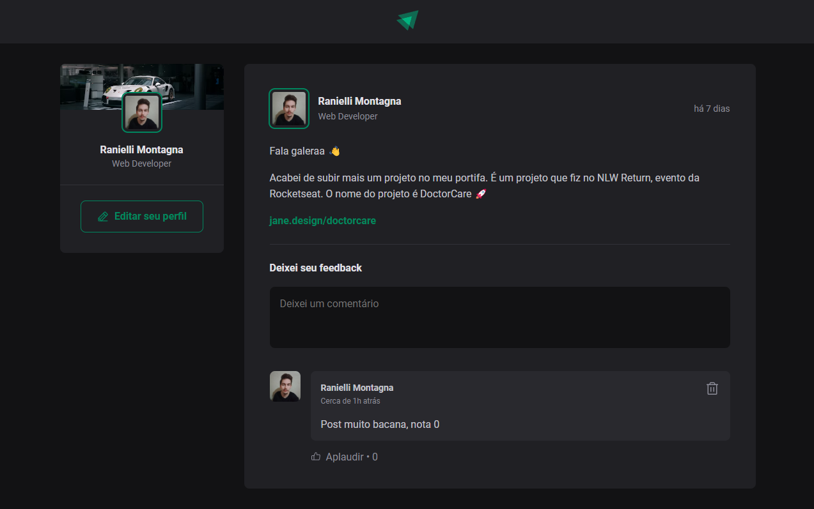

# Ignite Feed

O Ignite Feed é um projeto super simples de um feed de postagens, contendo feedbacks.



# 🚀 Tecnologias utilizadas

Esse projeto foi feito com o intuito de aprender mais sobre React, utilizando conceitos básicos. As tecnologias utilizadas foram:

- [ReactJS](https://reactjs.org/) - para a criação da interface
- [TypeScript](https://www.typescriptlang.org/) - para tipagem
- [Vite](https://vitejs.dev/) - para a criação do projeto
- [CSS](https://developer.mozilla.org/pt-BR/docs/Web/CSS) - para estilização

# 📁 Como baixar o projeto

```bash

# Clonar o repositório
$ git clone

# Entrar no diretório
$ cd ignite-feed

# Instalar as dependências
$ yarn ou npm install

# Iniciar o projeto
$ yarn dev ou npm run dev

```
